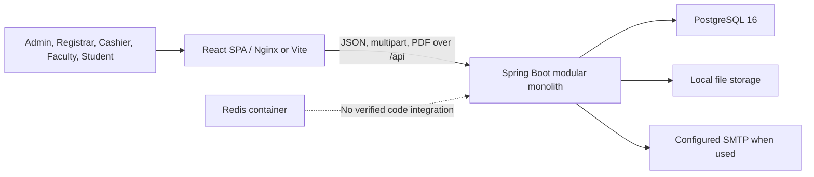

# System Architecture

## Current Architecture

The MVP is a modular monolith: one React single-page application communicates with one Spring Boot REST API backed by one PostgreSQL database. Faculty, student, cashier, registrar, and administrative experiences share the same frontend deployment and backend.

## Components

- **Frontend:** React Router selects administrative, faculty, or student shells; TanStack Query coordinates API state.
- **Backend:** Package-by-module controllers, services, repositories/entities, DTO validation, security, audit, file storage, and PDF report generation.
- **Database:** PostgreSQL schema managed by Flyway `V1`–`V15`; Hibernate uses `ddl-auto: validate`.
- **Authentication:** Stateless bearer access JWTs plus persisted, rotating/revocable refresh tokens.
- **External services:** SMTP dependency is configured in the build; no mandatory external SaaS integration is required. Redis is deployed but unused by verified code.
- **Deployment:** Docker Compose for local use; Nginx serves the production frontend container and proxies `/api` to the backend.

## Communication Flow

Login returns access and refresh tokens → frontend keeps access token in memory and refresh token in `sessionStorage` → API calls send bearer token → Spring Security authenticates → method permissions and ownership checks authorize → services access JPA/JDBC/files → standard `ApiResponse` JSON or file/PDF is returned.

## Related Notes

- [[Frontend Structure]]
- [[Backend Structure]]
- [[Authentication and Roles]]

